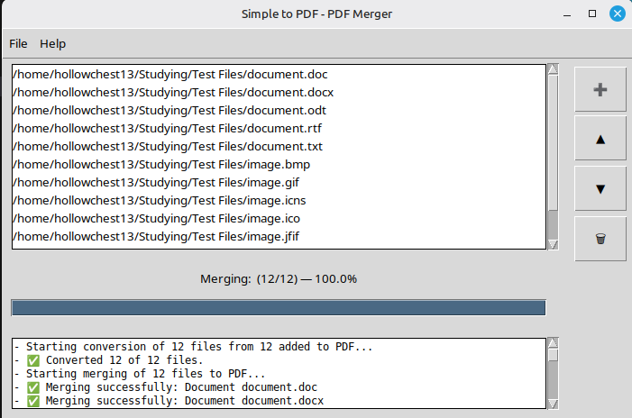
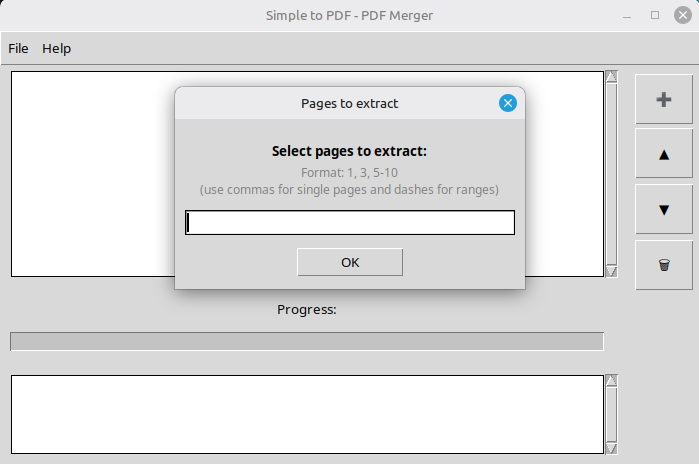

# Simple_to_PDF 📄🚀

## 📄 License
MIT License

**Simple_to_PDF** is a lightweight and powerful Python-based tool designed for batch converting office documents, spreadsheets, presentations, and images into a single, cohesive PDF file. It also features a built-in PDF utility for extracting specific page ranges from existing documents.

The project is built for **Linux (Mint, Ubuntu)** and **Windows** users, providing an intuitive Graphical User Interface (GUI) for complex file processing.

## 🖼 Screenshots

<p align="center">
  
  <br>
  <em>Main application window interface</em>
</p>

<p align="center">
  
  <br>
  <em>Process of extracting pages from PDF</em>
</p>

## 📌 Project Status
🟡 Actively developed  
⚠️ Feature-complete, testing in progress  
🧪 New features and fixes may be added

## ⚠️ Known Limitations
- Password-protected PDFs are not supported
- Very large files (>500MB) may require additional memory
- MS Office automation works only on Windows

---

## 🛠 Requirements
- **Python 3.10+ (developed and tested on Python 3.12.3)**
The application requires one of the following to be installed for documents conversion:

1. **Microsoft Office** (Windows only) — detected automatically via COM interface.
2. **LibreOffice** (Windows or Linux) — Used as a fallback or primary engine.

**Note for Windows users:** If you prefer LibreOffice, please ensure it is installed in one of the default locations:

 - `C:\Program Files\LibreOffice`
 - `C:\Program Files (x86)\LibreOffice`

---

### 🔄 Conversion Priority (Windows)
The application follows a specific priority order when choosing a conversion engine:
1. **Microsoft Office** (Primary) — If detected, it will be used by default for the best formatting accuracy.
2. **LibreOffice** (Fallback) — If Microsoft Office is not found, the app will automatically look for LibreOffice in the default system paths.

## ✨ Key Features
- **Batch Conversion:** Merge dozens of different file types into one PDF with a single click.
- **Order Management:** Easily rearrange the file sequence before merging.
- **Smart Processing:** Automatic image scaling and page orientation detection.
- **PDF Surgery:** Extract specific page ranges (e.g., 1, 3-5) from existing PDF files.
- **Detailed Logging:** Built-in logging system for quick troubleshooting and debugging.

---

## ⚙️ Conversion Engines & Formats

The application dynamically adapts to the software installed on your system. For full office document support, **MS Office** or **LibreOffice** is required.

### 1. MS Office Mode (Windows)
* **Documents:** .doc, .docx, .docm, .rtf, .txt
* **Tables:** .xls, .xlsx, .xlsm, .xlsb
* **Presentations:** .ppt, .pptx, .pptm, .pps, .ppsx

### 2. LibreOffice Mode (Linux / Windows)
* **Documents:** .doc, .docx, .odt, .rtf, .txt
* **Tables:** .xls, .xlsx, .xlsm, .xltx, .xltm, .xlsb, .ods, .csv
* **Presentations:** .ppt, .pptx, .odp

### 3. Standalone Mode (No Office Required)
If no office suite is detected, the app functions as a robust image-to-PDF converter and PDF editor:
* **PDF:** .pdf (merging and page extraction)
* **Images:** .jpg, .jpeg, .png, .bmp, .gif, .tiff, .tif, .webp, .ppm, .icns, .ico, .jfif, .jpe, .tga

---

## 🚀 Installation & Usage


### Clone the Repository
```bash
git clone [https://github.com/hollowchest13/Simple_to_PDF.git](https://github.com/hollowchest13/Simple_to_PDF.git)
cd Simple_to_PDF
```
## Environment Setup

### For Linux (Ubuntu / Mint):
1. **Install system dependencies:**

```bash
sudo apt update
sudo apt install python3-venv python3-tk
```
2. **Create and activate environment:**

```bash
python3 -m venv venv
source venv/bin/activate
```
3. **Install requirements:**

```bash
pip install --upgrade pip
pip install -r requirements.txt
```
### For Windows:
1. Create virtual environment in **PowerShell** or **CMD**:

```bash
python -m venv venv
```
2. Activate environment in **PowerShell** :

```bash
Set-ExecutionPolicy -ExecutionPolicy RemoteSigned -Scope Process
.\venv\Scripts\Activate.ps1
```
In **CMD**:

```bash
venv\Scripts\activate
```
3. Install requirements:

```bash
pip install -r requirements.txt
```
---
4. Getting Started:

```bash
python -m src.simple_to_pdf.cli
```

## 🛠 Technology Stack
Simple_to_PDF utilizes a multi-layered approach to handle various file formats efficiently:

### 🐍 Core Logic & System
Python 3.12.3: The heart of the application.

**Subprocess & Shutil:** Used for high-level system operations, such as calling LibreOffice in headless mode and managing file movements.

**Tempfile & Pathlib:** Ensure clean and safe file handling by using isolated temporary directories and cross-platform path management.

### 📊 Spreadsheet & Data Processing

**openpyxl:** A specialized library for reading and writing Excel (.xlsx, .xlsm) files. This allows the app to handle spreadsheet data independently of Microsoft Excel.

### 📄 Document Automation
**pypdf:** For professional PDF manipulation including merging, splitting, and metadata handling.

**pywin32 (COM Interop):** Provides native integration with MS Office for high-fidelity document rendering on Windows.

**Pillow:** The industry-standard library for image processing and raster-to-PDF conversion.

### 📝 Reliability & Maintenance
**Logging:** Comprehensive system logs with automated rotation to ensure the app remains easy to debug without wasting disk space.

---

## 📬 Support
If you encounter any issues or the program behaves unexpectedly:

1. Go to the **Help** menu in the top bar.
2. Choose **Show Logs**.
3. A window will open showing the real-time application history. 

Send the logs along with a short description of what happened to:

📧 **hollowchest13@gmail.com**

---

## 🤝 Contributing
Issues and pull requests are welcome.
Please open an issue before proposing major changes.
